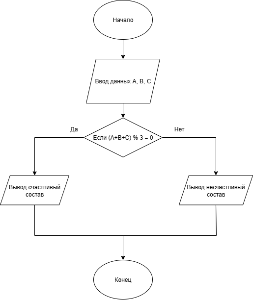

# Домашняя работа 3.1
## Условие задачи
Вариант 6. Команда мечты

Тренер формирует стартовый состав из трех игроков с номерами A, B и C. Он считает, что это "счастливая" тройка, если сумма номеров игроков делится на три без остатка. Запишите условие для "счастливой" тройки.
## 1. Алгоритм и блок-схема

### Алгоритм
1. **Начало**
  
2. Задать исходные данные:
   - А - номер первого игрока
   - В - номер второго игрока
   - С - номер третьего игрока
3. Условие:
   - (А + В + С) % 3 = 0
4. Вывод результатов:
   - Если условие выполняется: счастливый состав
   - Если уловие не выполняется: несчастливый состав

5. **Конец**

### Блок-схема

(https://viewer.diagrams.net/?tags=%7B%7D&lightbox=1&highlight=0000ff&edit=_blank&layers=1&nav=1&title=%D0%91%D0%BB%D0%BE%D0%BA-%D1%81%D1%85%D0%B5%D0%BC%D0%B0%20%D0%A4%D1%83%D1%82%D0%B1%D0%BE%D0%BB.png&dark=auto#R%3Cmxfile%3E%3Cdiagram%20name%3D%22%D0%A1%D1%82%D1%80%D0%B0%D0%BD%D0%B8%D1%86%D0%B0%20%E2%80%94%201%22%20id%3D%22XM4hgy8f1sLnK_y1EKSm%22%3E7VpZk5s4EP41VO0%2BJAXCYPw42N5spZKq1E5t5XhTQAPKysgRwkd%2B%2FbZAnMYezxTjmXF4wah1dNPdX3fTxrDnq907gdfxRx4SZiAz3Bn2wkDIsjwPfhRlX1Bc1y4IkaChXlQTbukvoommpmY0JGlroeScSbpuEwOeJCSQLRoWgm%2Fby%2B44a3Nd44gcEG4DzA6pn2ko44LqoWlN%2F5vQKC45W%2B6smFnhcrF%2BkjTGId82SPbSsOeCc1ncrXZzwpTySr0U%2B%2F46MlsJJkgiz9nAP5J%2FgiyU7z98%2B5Ht6ObfDfn8Rp%2BywSzTD2wgl8F5%2Fh2HY0FqudeqcH9mSlR%2FQ4SkoKA3mNEoMewbxSOJiaBqtl6njE5FayvOJG8ucCP9e2mOC9OY3airv8yvi%2FzqGAvL8NxSHlBlIVJbzAMyagmNQOvgnDDwtzGV5HaNAzWzBXwALZYrBiOr2tk0YGkNeF6ya5C0Qd8RviJS7GGJnkUT7VwVuvR4W%2FuqVTpg3PBTT9OwhkdUHV17ENxoJ3qAQ016HKqroBAQpodcyJhHPMFsWVN9wbMkJIqNCaN6zQfO11p5P4iUex0uciOfp9qUZyIgJ%2BTX4kosIiJPrNNRTD3LSUMJwrCkm3Y0GVzr6PeFcQFdM4futLyHq6%2Fh%2FXrBbNnPDWb3lYPZPhPM1nRoNOutnzjNwaAtbJttC9tdyxWS6l0d41ViPN6e9u8ZJkaOI8fXwlGlNJSnLtSoT6GqMvVNneEW5RUyn59fHVgGIkBwMP3iZ%2F7Q%2FPdyyJ1EA69Pa3ULeQAzRhiPBF7BwjUoG%2BIiEd25T%2FXEfcn7ju5I%2Be45VDJHTivUI6cnmTs9yXz2VMncmr2IbA4qFfsvav9bpxx%2B1cflg8WuNdrr0eOrgDK731sGoAuVAU6nDJhcuAxAfW%2F9oyc0NeRdxhNmHUdwLusIpT7GgvD6OKpComhoWY33YfBr8w84HIbIn%2F%2BpygqVqExb3alTVWi6YFYXMV99z9L7U%2FQgKbnz9jXtScnuJd%2Bvy7g74u%2F6OCr8ldX6JREFYJBt6OhHWgQAnbwaLh%2F2Rk%2BsaBgWKZ2k9Bf%2Bnh%2BlMu1aJZ7c6R3fcBb6YdO6UE6l4P%2BROWdc6SThCcmracY6pAHQa3ld9HoH6J30gNd%2BMvCO3ZSr5Vg3losUikYIDwBhezZ5YRAe69%2Br5agbaUVv7Fg7rYlxq%2F0XUkVBrfJZH1UdO8uPqqrs5cFGU28Ze2VH48LEaseFiTd965zXLXOfLDR4Y2i4Vo73h4YxHDxjOHC63dHeaNBXKDxZNLD7okG3Y5qEN%2BqDs7pkaqip3Sw91vmsuqIP7XwO19puqLgv3pa0gf8Id62O5YpW7kHj8%2FCgrrN0%2Fz450kEFS%2BF9Y5kuk48KPJn1C1w7VXHioO3ZyTl9%2Bhftdee20Uev6%2BVjoefwunO%2B%2Bqm9LmA4TWlwyvEe70DW6D8HueukiWFYf1FcLK%2B%2Fy7aX%2FwM%3D%3C%2Fdiagram%3E%3C%2Fmxfile%3E)

## 2. Реализация программы

    #define _CRT_SECURE_NO_DEPRECATE
    #include <stdio.h>
    #include <stdlib.h>
    #include <locale.h>
    #define _USE_MATH_DEFINES
    #include <math.h>
    int main() {
      int A, B, C;
      setlocale(LC_ALL, "RUS");
      // Ввод номеров игроков
      printf("Введите номера игроков A, B, C через пробел: ");
      scanf("%d %d %d", &A, &B, &C);

      // Проверка условия
      if ((A + B + C) % 3 == 0) {
          printf("Это счастливый состав.\n");
      }
      else {
          printf("Это не счастливый состав.\n");
      }
  
      return 0;
    }

## 3. Результаты работы программы
Sample Input:
  - 12 8 7

Sample Output:
 - Это счастливый состав.
## Разраборчик
Гусев Степан, бИЦ-251
